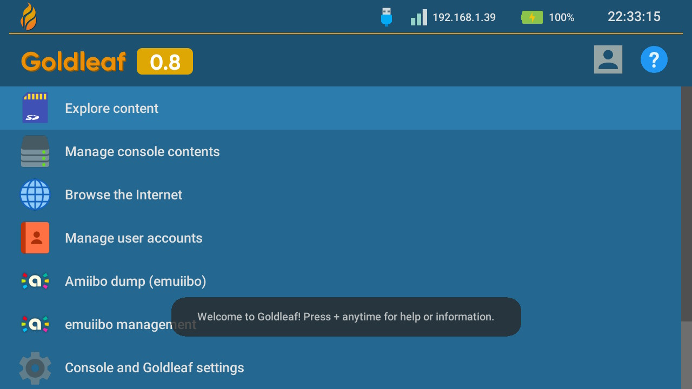
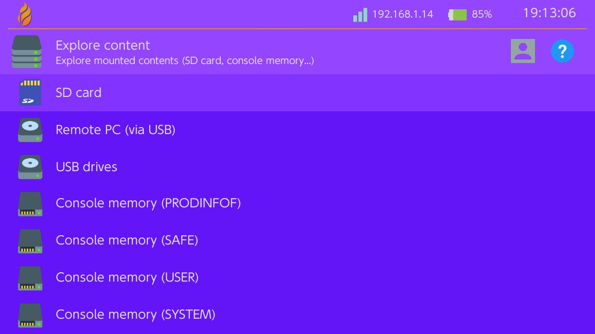
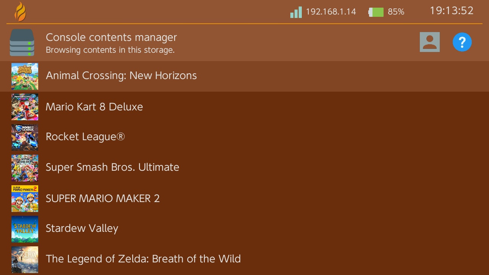
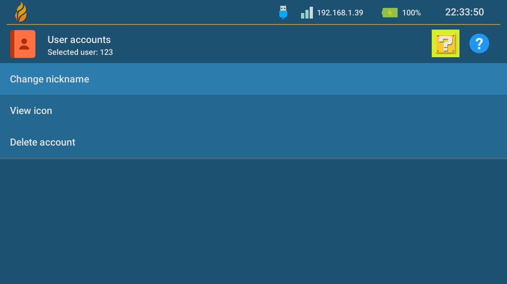
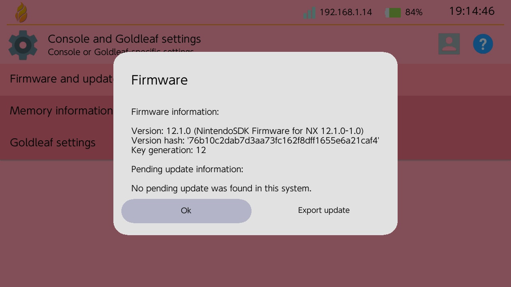
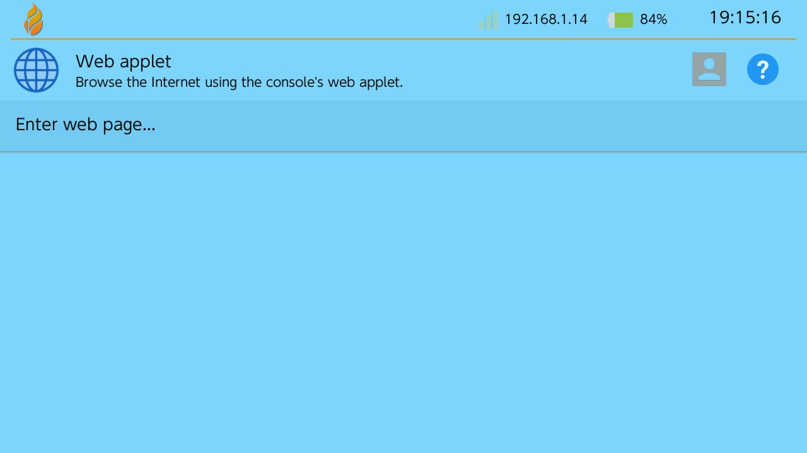
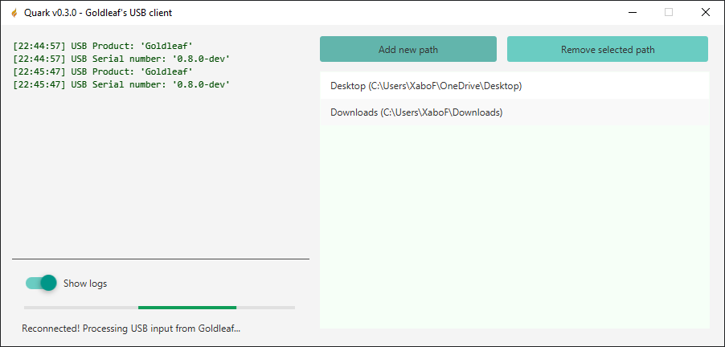
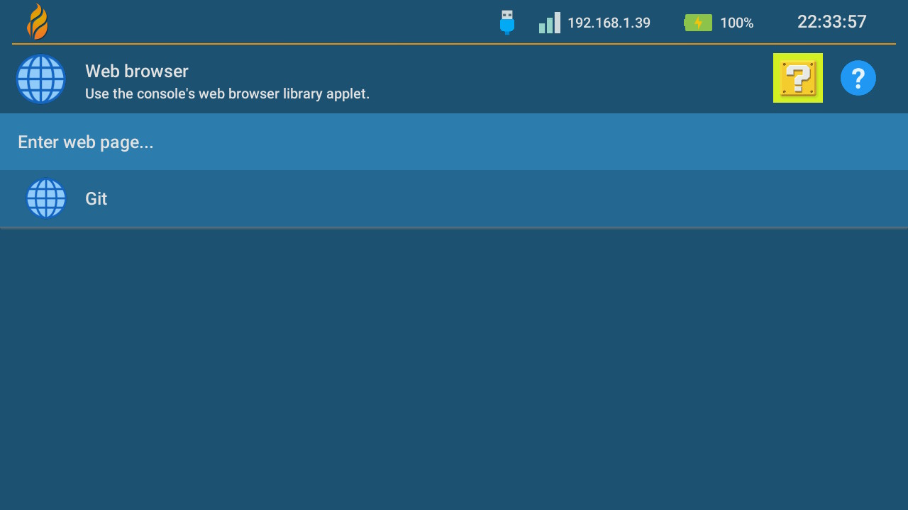
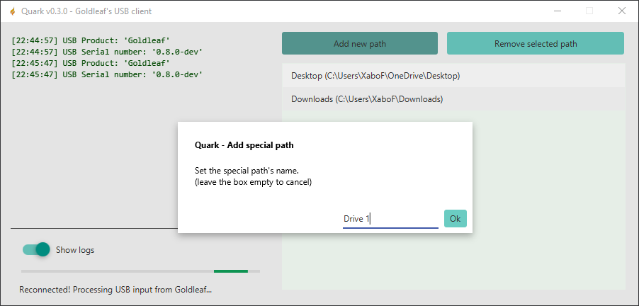

# Goldleaf

[](https://github.com/XorTroll/Goldleaf/releases/latest) [](https://github.com/XorTroll/Goldleaf/releases/latest)  **(thanks for 1M downloads 💜)**

> Goldleaf is multipurpose homebrew tool for Nintendo Switch.

  

  

  

# Table of contents

1. [Features](#features)
2. [Disclaimer](#disclaimer)
3. [Quark and remote PC](#quark-and-remote-pc)
4. [Settings](#settings)
5. [Known bugs](#known-bugs)
6. [Contributing](#contributing)
7. [Credits and support](#credits-and-support)

> Having any issues? Check [our FAQ](docs/FAQ.md) for help!

## **[Download it from here!](https://github.com/XorTroll/Goldleaf/releases)**

<p>
<a href="https://www.patreon.com/xortroll"></a>
<br>
<b>Do you like my work? Become a patron and support it!</b>
</p>

## Features

> Goldleaf's concept is very similar to [FBI](https://github.com/Steveice10/FBI)'s, a Nintendo 3DS homebrew tool.

- **Content explorer**: An easy-to-use but fully featured filesystem browser.

  - Supported locations/devices:

    - *SD card*

    - *Console memory (SAVE, SYSTEM, USER and PRODINFOF partitions)*

    - *Remote systems (via remote tools connected to Goldleaf like Quark)*

    - *Game savedata (check below how to mount it)*

    > Note: game savedata will be automatically unmounted when Goldleaf is exited

    - **[Experimental, not fully stable]** *USB drives (via fsp-usb WIP Atmosphere extension)*

  - Features:

    - Basic file operations: create, delete, copy, rename, view as hex/text, get size

    - Basic directory operations: create, delete, copy, rename, (un)set archive bit, get full size

    - Install NSP packages as applications/games, updates, etc. (**note: THIS INVOLVES BAN RISK!**)

    - Launch other NRO homebrews

    - Execute .bin files as RCM payloads

    - Set JPG/JPEG files as user icons (**note: THIS INVOLVES BAN RISK!**)

    - // TODO

- **Content manager**: an easy-to-use but fully featured content manager:

  - Basic content (application/title, update, DLC, etc.) operations:

    - View content information (ID, size, version, play stats...)

    - Uninstall/completely remove the content (won't remove savedata)

    - Export to NSP package

    - Mount savedata to navigate it (check the **Content explorer** above)

    - Remove ticket if present (**note: ONLY PLAY WITH THIS IF YOU KNOW WHAT YOU'RE DOING!**)

    - Reset launch version (useful to be able to play a base game after an update has been removed)

    > Note: some of this operations are not available with system titles or gamecart titles.

  - Check unused tickets, and remove them (**note: ONLY PLAY WITH THIS IF YOU KNOW WHAT YOU'RE DOING!**)

- **Web browser**: makes use of the console's web applet:

  - Browse user-submitted URLs

  - Create and save bookmarks (used to quickly browse pages)

- **Account manager**: select a user (or uses the selected one) and manage it:

  - Change nickname

  - Delete user (only if there is more than one in the system)

  > Note: to change the user's icon, check the **Content explorer** above

- **Amiibo dump**: create a virtual amiibo (for emuiibo) from a real amiibo figure.

- **emuiibo manager**: serves as a manager for emuiibo:

  - Toggle emulation (on/off)

  - Select virtual amiibo as active amiibo

  - Connect/disconnect currently selected virtual amiibo

- **Settings**: check both system and Goldleaf settings:

  - Firmware and updates:

    - Check current firmware information (version, hash, key generation)

    - Check for pending updates, and remove them if present

    - Export current firmware or pending update data

  - Memory: check free and total space on different locations

  - Goldleaf settings: check settings present in `settings.json`

- **Updates**: check for latest Goldleaf updates, and if a new release is out, update to it

- **About**: check Goldleaf's version and how it was launched (as an applet or an application)

> Goldleaf is also translated into 6 different languages: **English**, **Spanish**, **German**, **French**, **Italian** and **Dutch**.

### Controls

- Common:

  - **(LR-stick / R-stick / D-pad)**: Move through the current menu

  - **(ZL / ZR)**: Show a dialog to shut down or reboot the console.

  - **(Minus / -)**: Show a dialog with this control information.

  - **(Plus / +)**: Exit the application in order to return to hbmenu.

- Content explorer:

  - **(X)**: Unmount the selected location (only when a savedata location is selected)

  - **(Y)**: Select folder (might take some time with folders with many sub-items)

## Disclaimer

### NSP installs

Always keep in mind that installing NSP packages can be a very easy way to get banned. If you use airplane mode and special DNSs like 90DNS, there is a smaller chance to get banned.

**NEVER** install untrusted NSPs. Goldleaf doesn't do any special verification, so please be very careful about installing untrusted packages.

### Tickets

Tickets represent a game purchase - technically speaking, you can't launch a title if the ticket isn't present and the title requires it (official titles require them). NSP packages which don't have (nor require) a ticket are standard-crypto.

Goldleaf will display whether a ticket is present or not, and if so, it's titlekey. Titlekeys are required to decrypt and access a title's content. Otherwise, they are undecryptable, hence unlaunchable by the system.

## Quark and remote browsing

Quark is a PC tool, with a fancy UI and made in Java, in order to help Goldleaf with the remote PC option. It should work on Windows, Linux or Mac.

For details about how to properly setup Quark and USB, check [this small guide](Quark.md).

## Settings

Goldleaf supports the customization of colors, assets and other options via a JSON file located at Goldleaf's folder: `sd:/switch/Goldleaf/settings.json`.

### Sample

This is an example JSON for Goldleaf settings:

```json
{
    "general": {
        "customLanguage": "es",
        "externalRomFs": "/switch/Goldleaf/theme/rom"
    },
    "ui": {
        "background": "#aabbccdd",
        "base": "#aabbccdd",
        "baseFocus": "#aabbccdd",
        "text": "#aabbccdd",
        "menuItemSize": 80
    },
    "installs": {
        "ignoreRequiredFwVersion": false
    },
    "web": {
        "bookmarks": [
            {
                "name": "Google",
                "url": "https://www.google.com"
            },
            {
                "name": "GitHub",
                "url": "https://www.github.com"
            }
        ]
    }
}
```

If a certain attribute isn't present Goldleaf will use default values. For colors, Goldleaf will initially load default light/dark themes according to the console's theme color, and later, colors present in the JSON will be used instead of default theme ones.

### Notes

Via RomFs replacement, when Goldleaf tries to locate, for instance, `romfs:/FileSystem/FileDataFont.ttf` resource font, if `romfsReplace` is true and `romfsReplacePath` is, for instance, `/switch/Goldleaf/testromfs`, Goldleaf will look if `sd:/switch/Goldleaf/testromfs/FileSystem/FileDataFont.ttf` exists and use it if so, otherwise will use RomFs's one.

So, via this configurations, UI's images, resources, element sizes and even translations (using custom JSON translations) can be used, plus some more assets which will be added in future updates.

## Known bugs

- Exiting Goldleaf via HOME menu (as a NRO) seems to crash the system on 7.x firmwares due to a weird USB bug present on those specific versions. Any non-7.x firmware doesn't have this issue.

- Apparently, after browsing (more than 4 directories?) and then browsing (specific?) empty directories crashes Goldleaf. This issue is strangely common and needs to be looked into.

## Contributing

If you would like to contribute with new features, you are free to fork Goldleaf and open pull requests showcasing your additions.

If you just would like to suggest new ideas, but without actual code implementations, you're free to open an issue. Please try not to duplicate those, if the idea or problem is already reported in another issue.

You can always contact me on my Discord server (invite link below) as an easier way to suggest ideas or directly report issues.

### Translations

Read this before making any new translations:

- Goldleaf's aim is to, mainly, support languages supported by the console itself, so those not yet supported by Goldleaf and which aren't supported by consoles should have less priority and won't be probably accepted.

- Currently languages with special alphabets (like Russian or Arabic) are unsupported due to the lack of non-UTF-8 support for the JSON parser. This is planned to be solved soon.

## Credits and support

### Credits

The main concepts of Goldleaf are and have been developed by me (XorTroll), but without the effort and support of many others, this project wouldn't have been a thing:

- Adubbz and all the (old) [Tinfoil](https://github.com/Adubbz/Tinfoil) contributors, for their huge work with title installing.

- C4Phoenix, for his awesome work doing this project's logo, and the GIF displayed when launching the installed forwarder.

- All the graphics except Goldleaf's logo (see credit above) were grabbed from [Icons8](https://icons8.com).

- 2767mr, for all the support given in Goldtree (former Quark tool).

- developer.su for [NS-USBloader](https://github.com/developersu/ns-usbloader), which helped a lot on the development of Quark, mainly on the usage of usb4java and the base of a multi-platform JavaFX Java project.

- Simon for his libusbK implementation for C#, which has made Goldtree client possible.

- shchmue for the system to get tickets from system save data without breaking anything, found in [Lockpick](https://github.com/shchmue/Lockpick).

- WerWolv for the help with custom exception handling, avoiding those frustrating fatals.

- Translators: [unbranched](https://github.com/unbranched) and [exelix](https://github.com/exelix11) for Italian, [tiliarou](https://github.com/tiliarou), [FuryBaguette](https://github.com/FuryBaguette) and GOffrier#9688 for French, and [LoOkYe](https://github.com/lookye) and C4Phoenix for German.

- All the testers, for reporting bugs and helping a lot with the project's development.

### Discord and beta testing

If you would like to be more informed about my projects' status and support, you should check [my Discord server](https://discord.gg/3KpFyaH). It's a simple server for Nintendo hacking and homebrew, mainly focused on my projects. If you would like to be a beta-tester, then this is what you're looking for.
