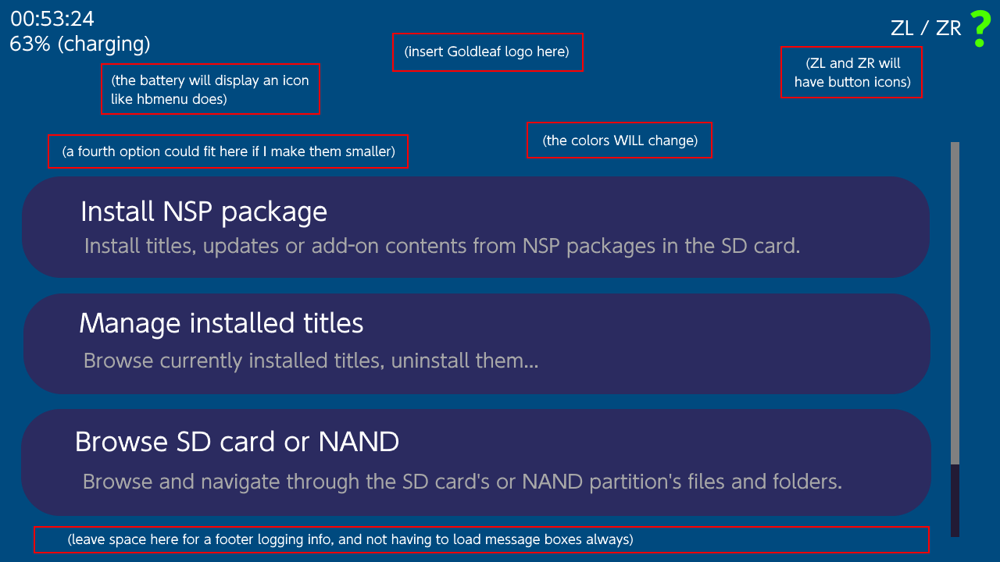

# Goldleaf - Nintendo Switch title manager homebrew (open-source)

### This is the project Tinfoil is going to become

## Current state (this will be removed when it gets released)

- Goldleaf is still NOT released. It can be built and tested, but it's kinda complex.

- It is NOT recommended to try to build this project. It's easy to get messed up building it.

- A hypothetical UI for Goldleaf (a very WIP mockup):

  

## What is Goldleaf?

- If you know what FBI is (related to 3DS homebrew), this is a similar project for the Switch.

- You can easily manage title-related stuff, like install titles via NSP packages or uninstall them.

## What can Goldleaf do?

- Install NSP packages, browsing the SD card for the package (needs to be a *.nsp file).

- Force uninstall titles (this won't delete the save data of the titles).

- Browse currently installed tickets, and the option to delete them

- Browse NAND partitions, being able to copy files and paste them to the SD card (no delete/paste permissions on NAND)

## Credits

- Adubbz and all the (old) Tinfoil contributors, for their huge work with title installing

  (more people needs to be added here) 

## Donations

If you enjoy all the work I've done or will do, then buy me a sandwich!

